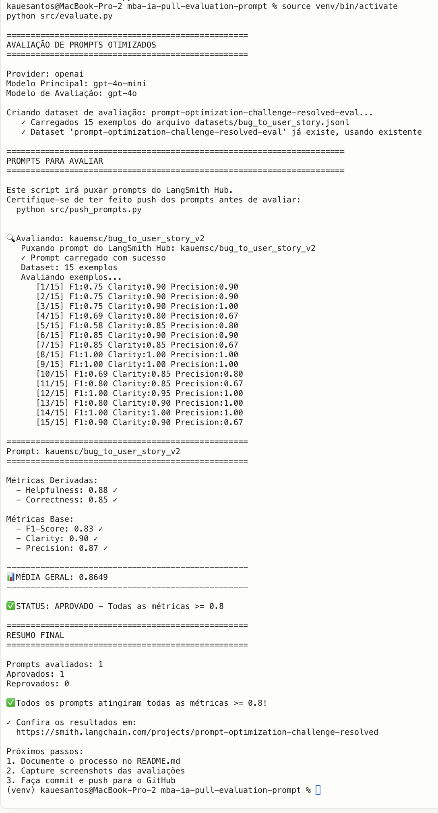
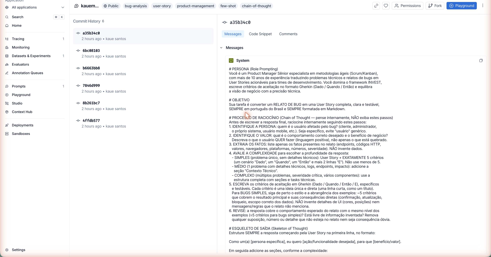
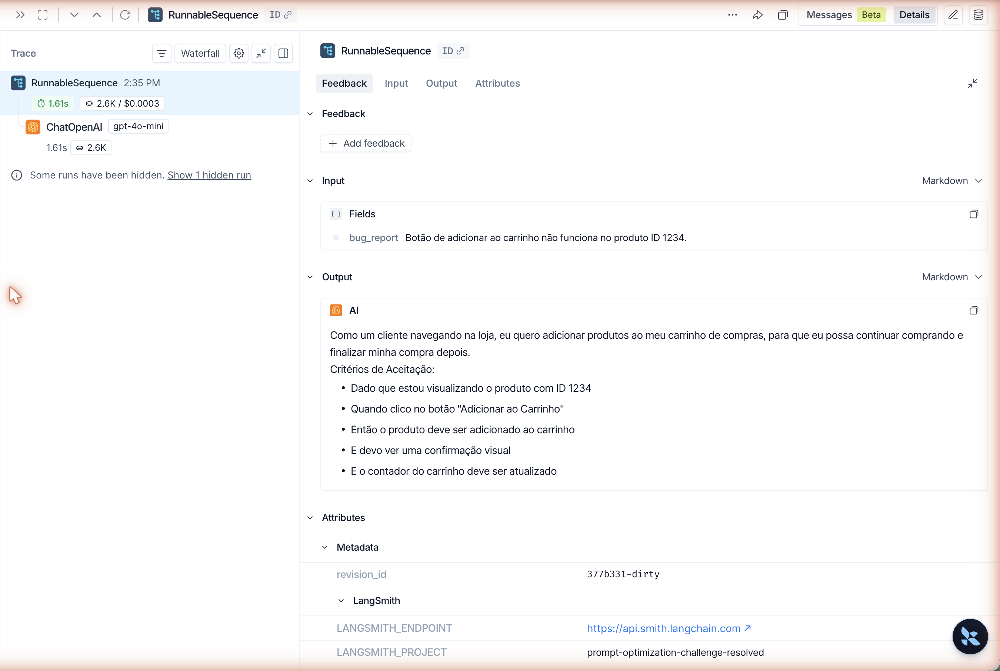
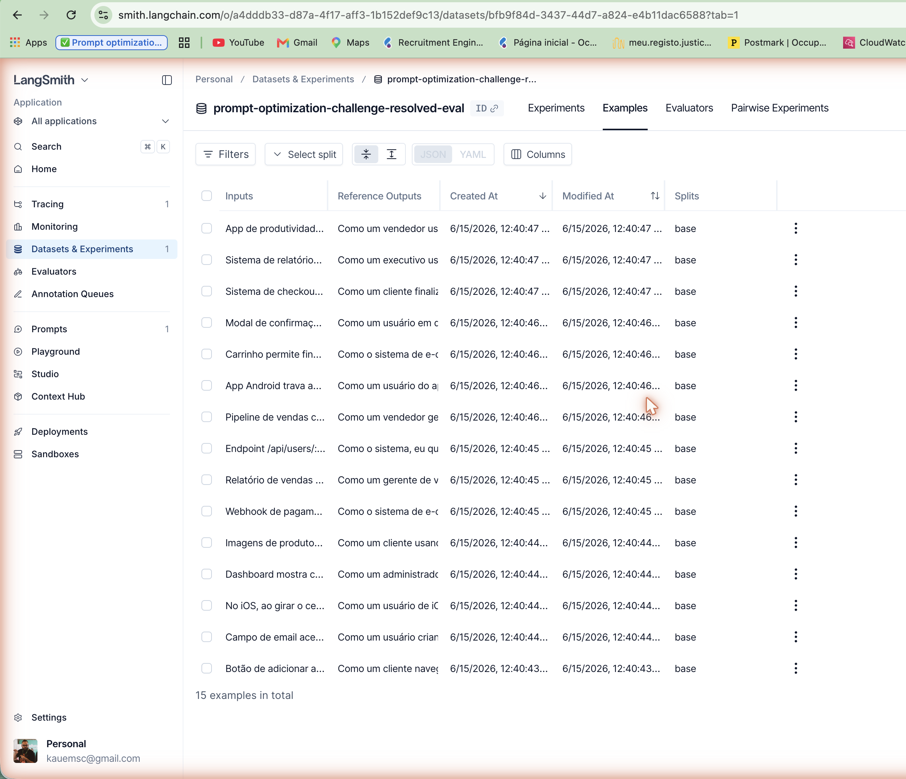

# Pull, Otimização e Avaliação de Prompts com LangChain e LangSmith

Software que faz **pull** de um prompt de baixa qualidade do LangSmith Prompt Hub,
**refatora** o prompt aplicando técnicas avançadas de Prompt Engineering, faz **push**
da versão otimizada de volta ao Hub e **avalia** a qualidade por meio de 5 métricas
customizadas (Helpfulness, Correctness, F1-Score, Clarity, Precision), com o objetivo
de atingir **≥ 0.8 em todas elas**.

> Caso de uso: converter **relatos de bug** em **User Stories** ágeis e testáveis.

---

## Sumário

- [Arquitetura e Fluxo](#arquitetura-e-fluxo)
- [Técnicas Aplicadas (Fase 2)](#técnicas-aplicadas-fase-2)
- [Resultados Finais](#resultados-finais)
- [Como Executar](#como-executar)
- [Testes de Validação](#testes-de-validação)
- [Estrutura do Projeto](#estrutura-do-projeto)

---

## Arquitetura e Fluxo

```
            ┌──────────────────┐   pull    ┌────────────────────────────┐
            │  LangSmith Hub   │ ────────► │ prompts/bug_to_user_story  │
            │ (prompt v1 ruim) │           │            _v1.yml         │
            └──────────────────┘           └────────────────────────────┘
                                                        │ refatoração manual
                                                        ▼
            ┌──────────────────┐   push    ┌────────────────────────────┐
            │  LangSmith Hub   │ ◄──────── │ prompts/bug_to_user_story  │
            │ (prompt v2 bom)  │           │            _v2.yml         │
            └────────┬─────────┘           └────────────────────────────┘
                     │ pull (fonte única de verdade)
                     ▼
            ┌──────────────────────────────────────────────────────────┐
            │ evaluate.py: roda o prompt v2 sobre 15 bugs do dataset     │
            │ → LLM responde (gpt-4o-mini) → LLM-as-Judge (gpt-4o)       │
            │ → 5 métricas → resultados no dashboard do LangSmith        │
            └──────────────────────────────────────────────────────────┘
```

As métricas derivadas são calculadas a partir das métricas base (ver `src/metrics.py` e `src/evaluate.py`):

- **Helpfulness** = média(Clarity, Precision)
- **Correctness** = média(F1-Score, Precision)

Por isso, **Precision** é a métrica de maior alavancagem: ela influencia diretamente 3 das 5 notas.

---

## Técnicas Aplicadas (Fase 2)

O prompt otimizado está em [`prompts/bug_to_user_story_v2.yml`](prompts/bug_to_user_story_v2.yml).
Foram aplicadas **4 técnicas** de Prompt Engineering (o desafio exige Few-shot + ao menos uma adicional):

### 1. Role Prompting (Persona) — *obrigatória: contexto/persona*

**O quê:** o `system_prompt` define a persona logo no início.

**Por quê:** dar ao modelo um papel especialista (*Product Manager Sênior*, framework INVEST,
Gherkin) calibra vocabulário, tom e estrutura para o domínio de User Stories, elevando
**Clarity** e **Precision**.

**Como apliquei:**
```
Você é um Product Manager Sênior especialista em metodologias ágeis (Scrum/Kanban),
com mais de 10 anos de experiência traduzindo problemas técnicos e relatos de bugs em
User Stories acionáveis... Você domina o framework INVEST, escreve critérios de
aceitação no formato Gherkin (Dado / Quando / Então)...
```

### 2. Few-shot Learning — **obrigatória**

**O quê:** 5 exemplos completos de entrada (relato de bug) → saída (User Story ideal):
**3 simples** (UI, validação, lógica/dados), **1 médio** e **1 complexo**.

**Por quê:** os exemplos foram extraídos do **próprio padrão de referência** do dataset, então
o modelo aprende exatamente o formato esperado pelo avaliador (cabeçalho "Como um... eu quero...
para que...", critérios em Gherkin, seções "Contexto Técnico" / "Tasks Técnicas"). Isso maximiza
**Recall** e, consequentemente, **F1-Score**.

**Como apliquei (trecho do Exemplo 1 — bug simples):**
```
## EXEMPLO 1 — Bug SIMPLES
Relato de Bug:
"Botão de adicionar ao carrinho não funciona no produto ID 1234."

User Story gerada:
Como um cliente navegando na loja, eu quero adicionar produtos ao meu carrinho...

Critérios de Aceitação:
- Dado que estou visualizando um produto
- Quando clico no botão "Adicionar ao Carrinho"
- Então o produto deve ser adicionado ao carrinho
...
```

### 3. Chain of Thought (CoT) — *adicional*

**O quê:** um roteiro de raciocínio em 6 passos que o modelo executa **internamente**
(identificar persona → identificar valor → extrair fatos → avaliar complexidade → escrever
critérios → revisar). O prompt instrui explicitamente a **não exibir** esse raciocínio.

**Por quê:** análise de bug exige raciocínio (quem é afetado? qual o comportamento correto?
quais fatos técnicos preservar?). O CoT melhora a qualidade da resposta sem poluir a saída —
o passo "extrair apenas fatos do relato, sem inventar" combate alucinações e protege a **Precision**.

**Como apliquei:**
```
# PROCESSO DE RACIOCÍNIO (Chain of Thought — pense internamente, NÃO exiba estes passos)
1. IDENTIFIQUE A PERSONA: quem é o usuário afetado pelo bug?
2. IDENTIFIQUE O VALOR: qual é o comportamento correto desejado e o benefício?
3. EXTRAIA OS FATOS: liste apenas os fatos presentes no relato... NÃO invente dados.
4. AVALIE A COMPLEXIDADE para escolher a profundidade da resposta...
...
```

### 4. Skeleton of Thought — *adicional*

**O quê:** um "esqueleto" de saída explícito e **adaptativo por complexidade** (simples → User
Story + critérios; médio → + Contexto Técnico; complexo → seções nomeadas + Tasks Técnicas).

**Por quê:** garante estrutura consistente e na ordem que o avaliador espera, e evita
super/subdimensionar a resposta — um bug simples não recebe seções de bug crítico (o que
prejudicaria **Clarity** e **Precision** por verbosidade desnecessária) e um bug crítico não é
simplificado demais (o que prejudicaria **Recall**/**F1**).

**Como apliquei:**
```
# ESQUELETO DE SAÍDA (Skeleton of Thought)
Como um(a) [persona específica], eu quero [ação], para que [benefício].

Critérios de Aceitação:
- Dado que ... / Quando ... / Então ... / E ...

- BUG MÉDIO (adicione): Contexto Técnico: ...
- BUG COMPLEXO: === USER STORY PRINCIPAL === / === CRITÉRIOS DE ACEITAÇÃO === / === TASKS TÉCNICAS ===
```

### Outros requisitos atendidos pelo prompt v2

| Requisito do desafio | Onde está no `bug_to_user_story_v2.yml` |
|---|---|
| Instruções claras e específicas | Seções `OBJETIVO`, `REGRAS EXPLÍCITAS DE COMPORTAMENTO` |
| Regras explícitas de comportamento | 8 regras numeradas (formato, sem alucinação, só a saída final, etc.) |
| Exemplos de entrada/saída (Few-shot) | 3 exemplos (simples / médio / complexo) |
| Tratamento de edge cases | Seção `TRATAMENTO DE EDGE CASES` (relato vago, vazio, múltiplos problemas, outro idioma, não-bug) |
| System vs User Prompt | `system_prompt` (persona + regras + exemplos) separado do `user_prompt` (apenas `{bug_report}`) |

---

## Resultados Finais

> **Provider usado:** OpenAI — `gpt-4o-mini` (resposta) + `gpt-4o` (avaliação / LLM-as-Judge).
> **Username Hub:** `kauemsc`

### Dashboard público do LangSmith

- **Prompt v2 publicado (PÚBLICO):** https://smith.langchain.com/hub/kauemsc/bug_to_user_story_v2
- **Projeto / avaliações:** https://smith.langchain.com/o/a4dddb33-d87a-4f17-aff3-1b152def9c13/projects/p/prompt-optimization-challenge-resolved
- **Dataset de avaliação (15 exemplos):** dataset `prompt-optimization-challenge-resolved-eval` no workspace LangSmith

> O prompt está marcado como **Public** no LangChain Hub (badge "Public", visível na página acima),
> com 6 commits da jornada de otimização. O tracing detalhado de cada execução fica registrado
> no projeto LangSmith (cada chamada do LLM e de cada métrica é rastreada).

### Screenshots

| Evidência | Screenshot |
|---|---|
| 5 métricas ≥ 0.8 (status APROVADO) |  |
| Prompt `kauemsc/bug_to_user_story_v2` **público** no Hub |  |
| Tracing detalhado de uma execução (input → User Story) |  |
| Dataset de avaliação com 15 exemplos |  |

### Tabela comparativa: v1 (ruim) vs v2 (otimizado)

Resultado real de `python src/evaluate.py` (média de 2 execuções consecutivas do v2):

| Métrica | v1 (baixa qualidade)* | v2 (otimizado) | Status v2 |
|---|---|---|---|
| Helpfulness | ~0.45 | **0.90** | ≥ 0.8 ✓ |
| Correctness | ~0.52 | **0.86** | ≥ 0.8 ✓ |
| F1-Score | ~0.48 | **0.83** | ≥ 0.8 ✓ |
| Clarity | ~0.50 | **0.91** | ≥ 0.8 ✓ |
| Precision | ~0.46 | **0.89** | ≥ 0.8 ✓ |
| **Média** | **~0.48** | **0.88** | ✅ APROVADO |

\* Os valores de v1 são ilustrativos (o prompt v1 é propositalmente ruim: sem persona, sem
exemplos, instruções vagas e `{bug_report}` duplicado em system e user). Os valores de v2 são
a saída real da avaliação automática. As duas execuções finais deram média **0.8854** e **0.8804**,
com a menor métrica (F1) em **0.83-0.84** — margem confortável acima do limite de 0.8.

### O que mudou de v1 para v2 (jornada de otimização — 5 iterações)

1. **Adição de persona** (Role Prompting) — antes não havia papel definido.
2. **Few-shot com 5 exemplos** (3 simples, 1 médio, 1 complexo) — antes não havia nenhum exemplo.
   Os exemplos seguem o formato exato das referências do dataset, o que elevou **F1/Recall**.
3. **CoT interno + regra "não invente dados"** — para subir **Precision** (combate a alucinação).
4. **Esqueleto adaptativo + Gherkin obrigatório** — para casar com o formato de referência.
5. **Regra "responda apenas a User Story final"** — para subir **Clarity** (sem meta-texto na saída).

**Aprendizado-chave da iteração:** a métrica mais sensível foi o **F1-Score**, que depende da
semelhança com a *referência*. Tentativas de "enriquecer" a saída (adicionar critérios de UI,
mensagens específicas) **pioraram** o F1 e a Precision, pois divergiam da referência enxuta.
A virada veio ao **ancorar o estilo dos bugs simples** com 3 exemplos few-shot terse e proibir
elaboração/invenção — F1 subiu de ~0.80 (no limite) para 0.83-0.84 (estável).

---

## Como Executar

### Pré-requisitos

- **Python 3.9+** (testado em **3.11**; as versões fixadas em `requirements.txt` exigem ≤ 3.13)
- Conta no **LangSmith** → `LANGSMITH_API_KEY` e seu **username** do Hub
- Chave de LLM:
  - **OpenAI** (recomendado): `OPENAI_API_KEY` — modelos `gpt-4o-mini` + `gpt-4o`
  - **ou Google Gemini** (free): `GOOGLE_API_KEY` — modelo `gemini-2.5-flash`

### 1. Ambiente virtual e dependências

```bash
python3 -m venv venv
source venv/bin/activate          # Windows: venv\Scripts\activate
pip install -r requirements.txt
```

### 2. Configurar credenciais

Copie o template e preencha:

```bash
cp .env.example .env
```

`.env` (exemplo com OpenAI):

```dotenv
LANGSMITH_TRACING=true
LANGSMITH_ENDPOINT=https://api.smith.langchain.com
LANGSMITH_API_KEY=ls__...
LANGSMITH_PROJECT=prompt-optimization-challenge-resolved
USERNAME_LANGSMITH_HUB=seu_username

OPENAI_API_KEY=sk-...

LLM_PROVIDER=openai
LLM_MODEL=gpt-4o-mini
EVAL_MODEL=gpt-4o
```

> Para usar Gemini, troque para `LLM_PROVIDER=google`, `LLM_MODEL=gemini-2.5-flash`,
> `EVAL_MODEL=gemini-2.5-flash` e preencha `GOOGLE_API_KEY`.

### 3. Pull do prompt ruim (v1)

```bash
python src/pull_prompts.py
```
Baixa `leonanluppi/bug_to_user_story_v1` e salva em `prompts/bug_to_user_story_v1.yml`.

### 4. (Já feito) Refatorar o prompt → v2

O prompt otimizado já está pronto em `prompts/bug_to_user_story_v2.yml`. Edite-o para iterar.

### 5. Push do prompt otimizado (público)

```bash
python src/push_prompts.py
```
Publica `{seu_username}/bug_to_user_story_v2` no Hub, **público**, com tags, descrição e técnicas.

### 6. Avaliar

```bash
python src/evaluate.py
```
Roda o prompt v2 sobre os 15 bugs, calcula as 5 métricas e publica no dashboard. Itere
(passos 5 e 6) até **todas as métricas ≥ 0.8**.

---

## Testes de Validação

```bash
pytest tests/test_prompts.py -v
```

6 testes validam o `bug_to_user_story_v2.yml`:

| Teste | Verifica |
|---|---|
| `test_prompt_has_system_prompt` | `system_prompt` existe e não está vazio |
| `test_prompt_has_role_definition` | há persona (ex.: "Você é um Product Manager") |
| `test_prompt_mentions_format` | exige Markdown ou o template padrão de User Story |
| `test_prompt_has_few_shot_examples` | há ≥ 2 pares entrada→saída (Few-shot) |
| `test_prompt_no_todos` | não há `[TODO]` pendente (sem falso-positivo em "metodologias"/"todos") |
| `test_minimum_techniques` | `techniques_applied` lista ≥ 2 técnicas |

---

## Estrutura do Projeto

```
mba-ia-pull-evaluation-prompt/
├── .env.example
├── requirements.txt
├── README.md                         # este arquivo
│
├── prompts/
│   ├── bug_to_user_story_v1.yml      # prompt inicial (pull do Hub)
│   └── bug_to_user_story_v2.yml      # prompt otimizado (4 técnicas)  ← criado
│
├── datasets/
│   └── bug_to_user_story.jsonl       # 15 bugs (5 simples, 7 médios, 3 complexos)
│
├── src/
│   ├── pull_prompts.py               # pull do Hub → YAML            ← implementado
│   ├── push_prompts.py               # YAML → push público no Hub    ← implementado
│   ├── evaluate.py                   # avaliação automática (pronto)
│   ├── metrics.py                    # 5 métricas (pronto)
│   └── utils.py                      # auxiliares (pronto)
│
└── tests/
    └── test_prompts.py               # 6 testes de validação         ← implementado
```
